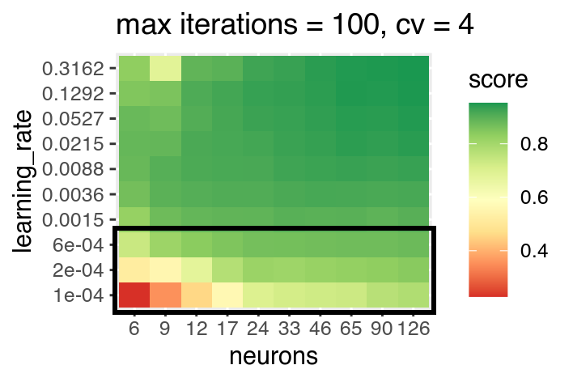

# pattern_recognition
## important notes:
- use any kind of libraries (make clear which ones, e.g. requirement.txt)
- make clear where copied code comes from
- Git: try to use branches and issues
- Due dates: 6.April: SVM, MLP; 20.April: CNN
- Work on full MNIST dataset, either csv or png format

## helpful links:
• A Simple Neural Network from Scratch with PyTorch and Google Colab: https://medium.com/dair-ai/a-simple-neural-network-from-scratch-with-pytorch-and-google-colab-c7f3830618e0

• Keras: https://keras.io/

• PyTorch tutorial: https://pytorch.org/tutorials/

## Report
## SVM

## MLP: Multilayer perceptron
### Introduction
An MLP is the simplest form of a neural network. It consists of at least three layers: an input layer, one or more hidden layers, and an output layer. Each node of every layer is connected to all the other nodes in the next layer. These edges' weights can be adjusted, changing the strenght and signage of the signal they forward trough the network. Each node contains an adjustable bias, that changes the activation a node needs to propagate a signal. 

MLPs require labeled training data, meaning they learn supervised. By comparing the actual output of the network against the truth, the network adjusts the weights and biases in a way that the distance between output and truth is minimized. This process is called backpropagation.
Compared to SVMs that find the global unique optimal decision boundaries, MLPs can get stuck in local minima. The same network should thus be rerun multiple times with randomly initialized weights and biases. 

Additionally, the performance of a network is determined by the parameters learning rate (how much the system adapts the weights and biases in each step), the number of hidden neurons and hidden layers, and the alpha parameter ("penalty term", used against over/underfitting). To find the optimal parameters, a gridsearch can be applied. 
We chose to implement the MLP with the SciKit library module [`sklearn.neural_network.MLPClassifier`](https://scikit-learn.org/stable/modules/generated/sklearn.neural_network.MLPClassifier.html). For a more high level overview of the module, refer to this page: [Multi-layer Perceptron](https://scikit-learn.org/stable/modules/neural_networks_supervised.html#multi-layer-perceptron)

SciKit also offers a GridSearch Tool for a wide range of estimators, which was helpful for figuring out the best parameters for our test set: [`GirdSearchCV`](https://scikit-learn.org/stable/modules/generated/sklearn.model_selection.GridSearchCV.html#sklearn.model_selection.GridSearchCV)
  
### Learning rate and neuron count
If the learning rate is to high, the algorithm adapts to single problems really fast but does not generalize or converge. In this test with one hidden layer extremely high learning rates heve been tested. A learning rate abvove one, or a neuron count below 10 are unviable, we will focus on the parameter values marked by the black rectangle in the future. The best result in this run was achieved with `hidden_layer_sizes = 1000, learning_rate = 0.112`. The alpha was fixed at `alpha = 0.0001` for all runs.

As there is a trade off for more neurons (longer processing times, more chance of overfitting), we try to minimize the neuron numbers as much as possible without taking a big hit in the final score (e.g. 56 neurons). In other words: not much score improvment is gained by increasing the neuron count from 56 to 1000. 

If we peek at the first 16 neurons in a sample with a way to high learning rate (`learning_rate = 3, neuron_count = 40`), we can get a an understanding of what exactly is going on: 

The neurons adapt really fast to the latest training data, and discard/forget previous samples. In this case, the whole network seems to have been adapted to perfectly match an '8'. We can also see traces of '3's, which have not been deleted as much as other integers, as they are similar to an '8'. The final score of this network was below 25%. 

Lets compare this to a network with a better successrate (`test_set_score = 0.9406`) with a lower learning rate (`learning_rate = 0.01, neuron_count = 40`):

The neurons seem to "generalize" in some way, we can detect reoccuring patterns in numbers, and even make out edge detectors: darker patterns surrounded by white borders.

What happens if we set the learning rate too low? We don't achieve an optimum within the maximum iteration steps we have set. Here is a heatmap of a gridsearch with only 100 iterations. We can see how the MLPs with low learning rates don't achieve an optimum within the given time (marked with black rectangle).

## CNN